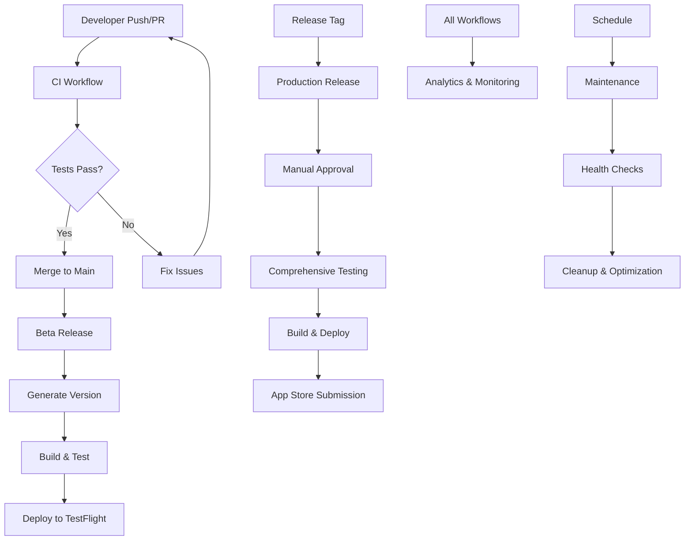
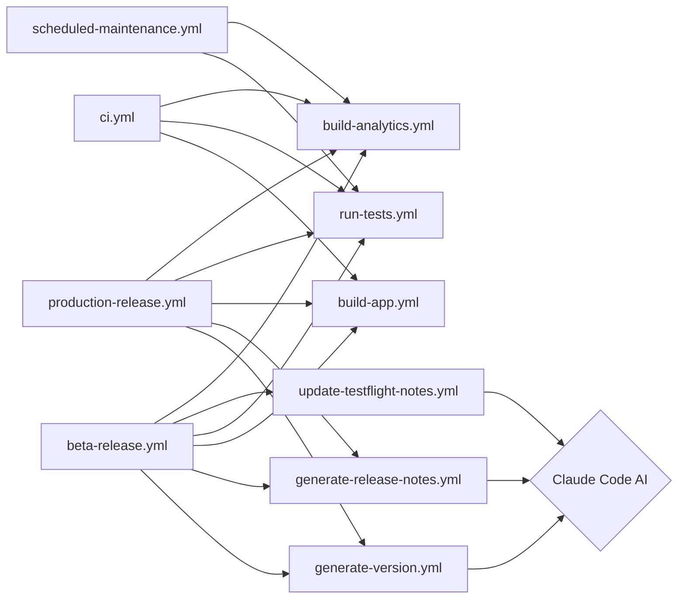

# MovingBox CI/CD Pipeline Overview

This document provides a comprehensive overview of the complete CI/CD pipeline for MovingBox, including all workflows, their relationships, and how they work together to deliver high-quality iOS applications.

## Pipeline Architecture



## Workflow Catalog

### 1. Core Workflows

#### **CI Pipeline** (`ci.yml`)
- **Trigger**: Pull requests, pushes to main
- **Purpose**: Validate code changes before merge
- **Duration**: 15-25 minutes
- **Key Features**:
  - Pre-flight checks and code quality analysis
  - Build validation with Debug configuration
  - Unit tests with code coverage
  - Critical UI tests for fast feedback
  - Security scanning
  - Comprehensive status reporting

#### **Beta Release** (`beta-release.yml`)
- **Trigger**: Push to main branch
- **Purpose**: Automatic beta builds for TestFlight
- **Duration**: 30-45 minutes
- **Key Features**:
  - Intelligent version generation with Claude Code
  - Comprehensive test suite execution
  - Release build with proper code signing
  - Automatic TestFlight upload
  - Release notes generation
  - Team notifications

#### **Production Release** (`production-release.yml`)
- **Trigger**: Version tags (v1.0.0 format)
- **Purpose**: App Store releases with full validation
- **Duration**: 45-60 minutes
- **Key Features**:
  - Manual approval gates for production safety
  - Complete test coverage validation
  - Production build with distribution signing
  - App Store Connect submission
  - GitHub release creation
  - Comprehensive audit trail

#### **Scheduled Maintenance** (`scheduled-maintenance.yml`)
- **Trigger**: Nightly (2 AM UTC) and weekly schedules
- **Purpose**: Repository health and optimization
- **Duration**: 10-30 minutes (depending on scope)
- **Key Features**:
  - Repository health checks
  - Build validation
  - Dependency security scanning
  - Cache cleanup and optimization
  - System resource monitoring

### 2. Reusable Workflows

#### **Build App** (`build-app.yml`)
- **Purpose**: Centralized app building logic
- **Reused by**: CI, Beta Release, Production Release
- **Features**:
  - Multi-configuration builds (Debug/Release)
  - Environment-specific secret management
  - Code signing automation
  - Build artifact generation
  - Performance optimization

#### **Run Tests** (`run-tests.yml`)
- **Purpose**: Comprehensive testing suite
- **Reused by**: CI, Beta Release, Production Release, Maintenance
- **Features**:
  - Unit, UI, and snapshot testing
  - Parallel test execution
  - Code coverage reporting
  - Multiple device configurations
  - Test result aggregation

#### **Generate Version** (`generate-version.yml`)
- **Purpose**: AI-powered version management
- **Reused by**: Beta Release, Production Release
- **Features**:
  - Claude Code integration for change analysis
  - Semantic versioning automation
  - Git tag creation
  - Version validation

#### **Generate Release Notes** (`generate-release-notes.yml`)
- **Purpose**: Automated release documentation
- **Reused by**: Beta Release, Production Release
- **Features**:
  - AI-powered release notes generation
  - Multi-format output (GitHub, App Store, TestFlight)
  - Change analysis and categorization
  - User-friendly language optimization

#### **Update TestFlight Notes** (`update-testflight-notes.yml`)
- **Purpose**: TestFlight "What to Test" automation
- **Reused by**: Beta Release, Manual workflows
- **Features**:
  - Testing focus analysis
  - Beta tester guidance generation
  - App Store Connect integration
  - Custom testing instructions

#### **Build Analytics** (`build-analytics.yml`)
- **Purpose**: Performance monitoring and optimization
- **Reused by**: All workflows
- **Features**:
  - Build performance metrics
  - Resource utilization tracking
  - Trend analysis
  - Performance scoring

## Workflow Relationships

### Primary Flows

1. **Development Flow**:
   ```
   Feature Branch → Pull Request → CI Pipeline → Code Review → Merge
   ```

2. **Beta Release Flow**:
   ```
   Main Branch Push → Version Generation → Testing → Build → TestFlight
   ```

3. **Production Release Flow**:
   ```
   Version Tag → Approval → Testing → Build → App Store → GitHub Release
   ```

4. **Maintenance Flow**:
   ```
   Schedule → Health Check → Testing → Cleanup → Reporting
   ```

### Dependency Map



## Environment Configuration

### Secrets Management

**Development & API Secrets**:
- `JWT_SECRET` - OpenAI proxy authentication
- `REVENUE_CAT_API_KEY` - Subscription management
- `SENTRY_DSN` - Error tracking
- `TELEMETRY_DECK_APP_ID` - Analytics

**Code Signing (Production)**:
- `KEYCHAIN_PASSWORD` - Build keychain
- `CERTIFICATES_P12` - Distribution certificates
- `CERTIFICATES_PASSWORD` - Certificate password
- `PROVISIONING_PROFILE` - App provisioning

**App Store Connect**:
- `APP_STORE_CONNECT_API_KEY_ID`
- `APP_STORE_CONNECT_ISSUER_ID`
- `APP_STORE_CONNECT_API_PRIVATE_KEY`

**AI Integration**:
- `ANTHROPIC_API_KEY` - Claude Code features

### Environment Protection

- **Development**: No restrictions
- **Beta**: Team lead approval required
- **Production**: Maintainer approval + release branch only

## Performance Optimization

### Build Caching Strategy

1. **Multi-layer Caching**:
   - Layer 1: GitHub Actions (dependencies)
   - Layer 2: Local Runner (build artifacts)
   - Layer 3: Orchard/Tart VM (environment)

2. **Cache Management**:
   - Smart invalidation based on dependency changes
   - Automated cleanup of stale caches
   - Performance monitoring and optimization

3. **Build Optimization**:
   - Parallel compilation and testing
   - Incremental builds when possible
   - Resource usage optimization

### Performance Targets

| Workflow | Target Duration | Cache Hit Rate | Success Rate |
|----------|----------------|----------------|--------------|
| CI Pipeline | < 20 minutes | > 80% | > 95% |
| Beta Release | < 35 minutes | > 85% | > 98% |
| Production Release | < 50 minutes | > 90% | > 99% |
| Maintenance | < 15 minutes | N/A | > 95% |

## Monitoring & Analytics

### Key Metrics Tracked

1. **Build Performance**:
   - Build duration and success rates
   - Cache effectiveness
   - Resource utilization
   - Queue times and concurrency

2. **Quality Metrics**:
   - Test coverage and pass rates
   - Code quality scores
   - Security scan results
   - Dependency health

3. **Deployment Metrics**:
   - Release frequency
   - Time to deployment
   - Rollback frequency
   - User adoption rates

### Alerting & Notifications

- **Slack Integration**: Real-time workflow notifications
- **Email Alerts**: Critical failure notifications
- **Dashboard Updates**: Continuous metrics visualization
- **Trend Analysis**: Weekly performance reports

## Claude Code AI Integration

### Intelligent Features

1. **Version Management**:
   - Automated semantic versioning
   - Change impact analysis
   - Breaking change detection

2. **Release Notes**:
   - User-friendly language generation
   - Multi-audience targeting
   - Feature categorization

3. **Testing Guidance**:
   - TestFlight testing instructions
   - Risk-based test prioritization
   - Regression test recommendations

4. **Performance Analysis**:
   - Build optimization suggestions
   - Resource usage analysis
   - Trend identification

## Security & Compliance

### Security Measures

1. **Secrets Management**:
   - Encrypted secret storage
   - Environment-based access control
   - Regular secret rotation

2. **Code Signing**:
   - Secure certificate management
   - Automated provisioning profile updates
   - Code signing validation

3. **Dependency Security**:
   - Automated vulnerability scanning
   - Dependency update recommendations
   - License compliance checking

4. **Audit Trail**:
   - Complete deployment history
   - Change tracking and attribution
   - Compliance reporting

### Best Practices

- **Least Privilege**: Minimal required permissions
- **Defense in Depth**: Multiple security layers
- **Regular Updates**: Automated dependency updates
- **Monitoring**: Continuous security monitoring

## Troubleshooting Guide

### Common Issues

1. **Build Failures**:
   - Check dependency resolution
   - Verify certificate validity
   - Review simulator availability

2. **Test Failures**:
   - Analyze test logs and screenshots
   - Check environment configuration
   - Verify test data consistency

3. **Deployment Issues**:
   - Validate App Store Connect credentials
   - Check provisioning profile status
   - Review build configuration

4. **Performance Problems**:
   - Analyze cache hit rates
   - Check resource utilization
   - Review concurrent job limits

### Emergency Procedures

1. **Critical Build Failure**:
   - Disable automatic deployments
   - Investigate root cause
   - Deploy hotfix if necessary

2. **Security Incident**:
   - Rotate affected credentials
   - Audit access logs
   - Update security measures

3. **Performance Degradation**:
   - Scale runner resources
   - Optimize cache strategy
   - Review workflow efficiency

## Getting Started

### For Developers

1. **First Time Setup**:
   ```bash
   # Clone repository
   git clone https://github.com/your-org/MovingBox
   cd MovingBox
   
   # Install dependencies
   ./scripts/setup-development.sh
   
   # Run local validation
   ./scripts/validate-build.sh
   ```

2. **Daily Workflow**:
   - Create feature branch
   - Make changes and commit
   - Push and create pull request
   - CI pipeline validates automatically
   - Merge after approval

### For Release Managers

1. **Beta Release**:
   - Merge features to main branch
   - Pipeline creates beta automatically
   - Monitor TestFlight deployment
   - Gather beta feedback

2. **Production Release**:
   - Create version tag (e.g., `v1.2.0`)
   - Approve production deployment
   - Monitor App Store submission
   - Coordinate launch communications

### For DevOps/Administrators

1. **Pipeline Maintenance**:
   - Monitor performance metrics
   - Review security scans
   - Update dependencies
   - Optimize cache strategies

2. **Troubleshooting**:
   - Use analytics dashboards
   - Review workflow logs
   - Check runner health
   - Analyze performance trends

## Continuous Improvement

### Regular Reviews

- **Weekly**: Performance metrics and optimization opportunities
- **Monthly**: Security posture and dependency updates
- **Quarterly**: Architecture review and strategic improvements
- **Annually**: Complete pipeline redesign evaluation

### Feedback Loops

- Developer experience surveys
- Build performance analysis
- User feedback integration
- Industry best practice adoption

---

## Quick Reference

### Workflow Status

| Workflow | Status | Last Updated | Next Review |
|----------|--------|--------------|-------------|
| CI Pipeline | ✅ Production | 2025-01-21 | 2025-02-21 |
| Beta Release | ✅ Production | 2025-01-21 | 2025-02-21 |
| Production Release | ✅ Production | 2025-01-21 | 2025-02-21 |
| Maintenance | ✅ Production | 2025-01-21 | 2025-02-21 |

### Key Contacts

- **Pipeline Owner**: Development Team Lead
- **Security**: Security Team
- **Infrastructure**: DevOps Team
- **Emergency**: On-call Engineer

### Useful Links

- [GitHub Actions Dashboard](https://github.com/your-org/MovingBox/actions)
- [App Store Connect](https://appstoreconnect.apple.com/)
- [TestFlight](https://appstoreconnect.apple.com/apps/testflight)
- [Monitoring Dashboard](https://your-monitoring-url.com)
- [Documentation](https://docs.your-org.com/movingbox)